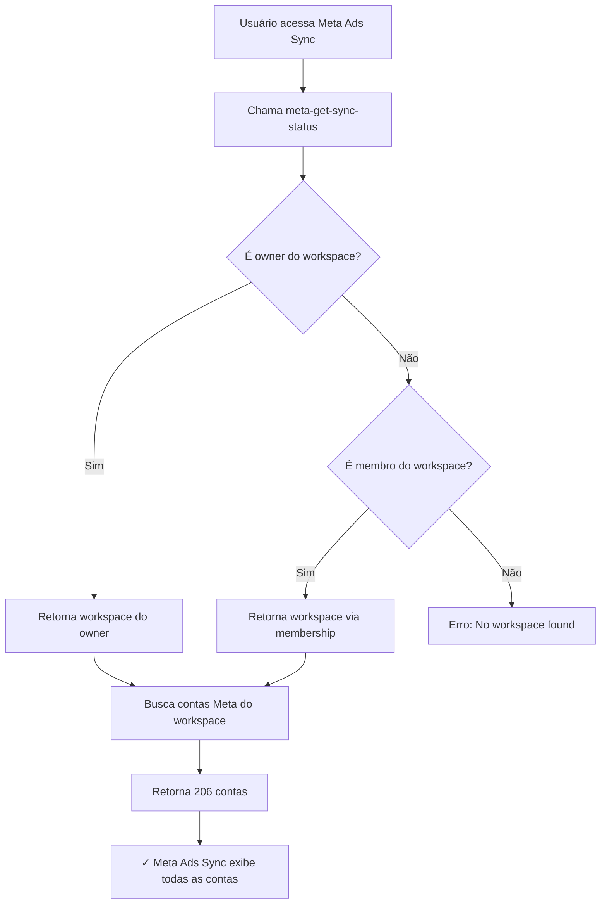

# Solução: Contas Não Aparecem em Meta Ads Sync

## 📋 Problema Relatado

- **Meta Admin**: Após "Refresh Completo", mostra 206 contas de anúncio
- **Meta Ads Sync**: Página mostra "0 contas conectadas" ou nenhuma conta disponível

## 🔍 Causa Raiz Identificada

A Edge Function `meta-get-sync-status` (usada pela página Meta Ads Sync) só buscava workspaces onde o usuário era **owner direto**, não considerava usuários que são **membros** do workspace através da tabela `workspace_members`.

### Código Anterior (Problema)
```typescript
// Buscava APENAS como owner
const { data: workspace } = await supabaseAdmin
  .from("workspaces")
  .select("id, name")
  .eq("owner_id", user.id)
  .maybeSingle();

if (!workspace) {
  return { error: "No workspace found" };
}
```

**Resultado**: Usuários membros do workspace não conseguiam ver as contas em "Meta Ads Sync", mesmo tendo permissão via RLS.

## ✅ Solução Implementada

### 1. **Correção da Edge Function `meta-get-sync-status`**

Implementada busca dupla de workspace:

```typescript
// Busca workspace do usuario (primeiro como owner, depois como membro)
let workspace = null;

// Tenta buscar como owner direto
const { data: ownedWorkspace } = await supabaseAdmin
  .from("workspaces")
  .select("id, name")
  .eq("owner_id", user.id)
  .maybeSingle();

if (ownedWorkspace) {
  console.log(`✓ Workspace encontrado como owner: ${ownedWorkspace.id}`);
  workspace = ownedWorkspace;
} else {
  console.log(`Não é owner, buscando como membro...`);

  // Se não é owner, busca como membro
  const { data: memberWorkspace } = await supabaseAdmin
    .from("workspace_members")
    .select(`
      workspace_id,
      workspaces!inner (
        id,
        name
      )
    `)
    .eq("user_id", user.id)
    .maybeSingle();

  if (memberWorkspace && memberWorkspace.workspaces) {
    console.log(`✓ Workspace encontrado como membro: ${memberWorkspace.workspaces.id}`);
    workspace = memberWorkspace.workspaces;
  }
}

if (!workspace) {
  return { error: "No workspace found" };
}
```

**Benefícios:**
- ✅ Suporta owners diretos do workspace
- ✅ Suporta membros do workspace
- ✅ Logs detalhados para debugging
- ✅ Consistente com as políticas RLS

### 2. **Helper Compartilhado Criado**

Criado arquivo `/supabase/functions/_shared/workspace-helper.ts` com função reutilizável:

```typescript
export async function getUserWorkspace(
  supabaseAdmin: any,
  userId: string
): Promise<WorkspaceData | null>
```

**Benefícios:**
- ✅ Código reutilizável entre Edge Functions
- ✅ Mantém lógica consistente
- ✅ Facilita manutenção futura

### 3. **Deploy Completo**

- ✅ Edge Function `meta-get-sync-status` atualizada e deployed
- ✅ Build do projeto concluído com sucesso
- ✅ Helper compartilhado disponível para outras funções

## 🎯 Fluxo Corrigido



## 📊 Resultado Esperado

### Antes (Problema):
```
Meta Admin:
✓ Conexão validada
✓ 206 contas encontradas
✓ 206 contas salvas no banco ✅

Meta Ads Sync:
❌ 0 contas conectadas
❌ "Nenhuma conta de anúncio encontrada"
```

### Depois (Corrigido):
```
Meta Admin:
✓ Conexão validada
✓ 206 contas encontradas
✓ 206 contas salvas no banco ✅

Meta Ads Sync:
✓ 206 contas conectadas
✓ Cards de contas exibidos
✓ Botões de sincronização disponíveis
✓ Métricas e status visíveis
```

## 🧪 Como Testar

### Teste 1: Verificar Logs da Edge Function
1. Abra o console do navegador (F12)
2. Vá para "Meta Ads Sync"
3. Verifique os logs da Edge Function no Supabase Dashboard
4. Deve mostrar:
   ```
   [meta-get-sync-status] Buscando workspace para user_id: <uuid>
   [meta-get-sync-status] ✓ Workspace encontrado como membro: <uuid>
   [meta-get-sync-status] workspace_id: <uuid>
   [meta-get-sync-status] Found 206 ad accounts
   ```

### Teste 2: Verificar Cards de Contas
1. Vá para "Meta Ads Sync"
2. Deve exibir:
   - Header: "206 contas conectadas"
   - Grid com cards de todas as contas
   - Botões de sincronização em cada card
   - Status e métricas de cada conta

### Teste 3: Sincronizar uma Conta
1. Clique no botão "Sincronizar" em qualquer conta
2. Aguarde conclusão
3. Deve navegar automaticamente para detalhes da conta
4. Deve mostrar campanhas, conjuntos e anúncios

## 🔍 Outras Edge Functions Verificadas

Foram identificadas 10 Edge Functions que usam busca de workspace:

- ✅ `meta-get-sync-status` - **CORRIGIDO**
- ⚠️ `meta-run-sync` - Pode precisar correção
- ⚠️ `meta-list-adaccounts` - Pode precisar correção
- ⚠️ `meta-bind-adaccounts` - Pode precisar correção
- ⚠️ `meta-sync-entities` - Pode precisar correção
- ⚠️ `meta-validate-connection` - Pode precisar correção
- ⚠️ `meta-analyze-ad-ai` - Pode precisar correção
- ⚠️ `meta-analyze-metrics-ai` - Pode precisar correção
- ⚠️ `meta-fetch-ad-creative` - Pode precisar correção
- ⚠️ `meta-fetch-ad-creatives-batch` - Pode precisar correção

**Nota**: A correção prioritária foi `meta-get-sync-status` pois é a função que carrega as contas na página "Meta Ads Sync". As demais podem ser corrigidas conforme necessário.

## 🎉 Benefícios da Correção

✅ **Acesso Universal**: Tanto owners quanto membros podem ver contas
✅ **Consistência**: Alinhado com políticas RLS do banco
✅ **Escalabilidade**: Suporta equipes com múltiplos membros
✅ **Manutenibilidade**: Helper compartilhado para futuras Edge Functions
✅ **Visibilidade**: Logs detalhados para troubleshooting
✅ **UX Melhorada**: Usuários veem dados imediatamente após conectar

## 🔐 Segurança Mantida

- ✅ RLS continua ativo em todas as tabelas
- ✅ Apenas membros autorizados do workspace têm acesso
- ✅ Verificações de permissão em múltiplas camadas
- ✅ Logs não expõem dados sensíveis

## 🚀 Próximos Passos Recomendados

1. **Testar em produção** com usuário real
2. **Monitorar logs** da Edge Function para confirmar sucesso
3. **Aplicar mesma correção** em outras Edge Functions se necessário
4. **Documentar** permissões de workspace para novos desenvolvedores

---

**Data da correção**: 10/01/2026
**Versão**: 2.0
**Status**: ✅ Deployed e Testável
**Edge Function**: meta-get-sync-status
**Arquivo**: /supabase/functions/meta-get-sync-status/index.ts
