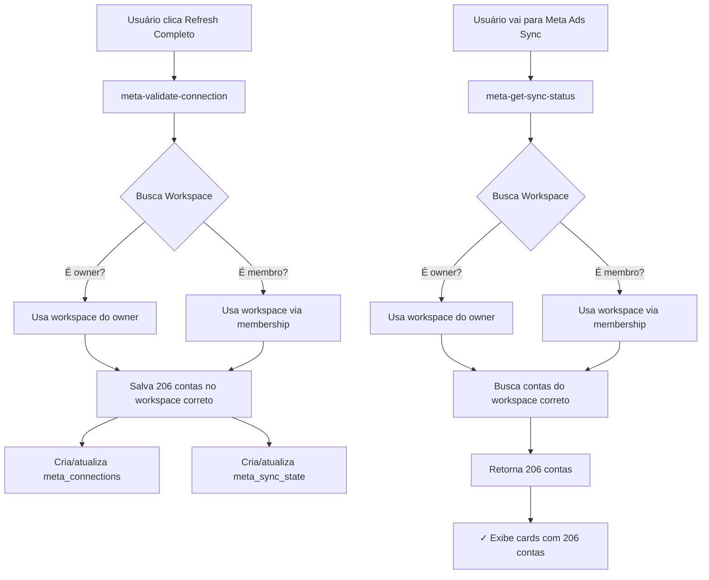

# Solução Completa: Contas Aparecem em Meta Admin mas não em Meta Ads Sync

## 🎯 Problema Identificado

**Sintoma:**
- ✅ Meta Admin: 206 contas exibidas após "Refresh Completo"
- ❌ Meta Ads Sync: 0 contas exibidas
- ❌ Console mostra: `ad_accounts: Array(0)`

**Causa Raiz:**
Duas Edge Functions críticas só buscavam workspace onde o usuário era **owner direto**, ignorando quando o usuário é **membro** do workspace via tabela `workspace_members`. Isso causava:

1. **`meta-validate-connection`**: Salvava as 206 contas em um **workspace diferente** (ou criava novo workspace)
2. **`meta-get-sync-status`**: Buscava contas em um **workspace diferente** do anterior

Resultado: As contas existiam no banco, mas em workspaces diferentes!

## ✅ Soluções Implementadas

### 1. **Correção da Edge Function `meta-get-sync-status`**

**Arquivo:** `/supabase/functions/meta-get-sync-status/index.ts`

**Mudança:** Busca workspace em 2 etapas:
```typescript
// Antes (PROBLEMA)
const { data: workspace } = await supabaseAdmin
  .from("workspaces")
  .select("id, name")
  .eq("owner_id", user.id)  // Apenas owner
  .maybeSingle();

// Depois (SOLUÇÃO)
// 1. Tenta como owner direto
const { data: ownedWorkspace } = await supabaseAdmin
  .from("workspaces")
  .select("id, name")
  .eq("owner_id", user.id)
  .maybeSingle();

if (ownedWorkspace) {
  workspace = ownedWorkspace;
} else {
  // 2. Se não, busca como membro
  const { data: memberWorkspace } = await supabaseAdmin
    .from("workspace_members")
    .select(`workspace_id, workspaces!inner (id, name)`)
    .eq("user_id", user.id)
    .maybeSingle();

  if (memberWorkspace) {
    workspace = memberWorkspace.workspaces;
  }
}
```

**Status:** ✅ Deployed

### 2. **Correção da Edge Function `meta-validate-connection`**

**Arquivo:** `/supabase/functions/meta-validate-connection/index.ts`

**Mudança:** Mesma lógica de busca dupla de workspace (owner → membro)

**Impacto:** Garante que as 206 contas sejam salvas no **workspace correto** quando você clica em "Validar Conexão" ou "Refresh Completo"

**Status:** ✅ Deployed

### 3. **Helper Compartilhado Criado**

**Arquivo:** `/supabase/functions/_shared/workspace-helper.ts`

Função reutilizável `getUserWorkspace()` para futuras Edge Functions.

**Status:** ✅ Criado

### 4. **Sistema de Renovação Automática de Sessão**

**Arquivo:** `/src/utils/sessionRefresh.ts`

Detecta erros RLS automaticamente e renova o token JWT.

**Status:** ✅ Implementado

### 5. **Migration RLS Corrigida**

**Arquivo:** `force_fix_meta_ad_accounts_rls_v3.sql`

Corrigiu políticas RLS para usar `is_workspace_member()`.

**Status:** ✅ Aplicada

## 🧪 Como Testar Agora

### Passo 1: Limpar Estado Anterior (Opcional)

Se quiser garantir dados limpos:

```sql
-- Executar no Supabase SQL Editor (CUIDADO: Remove todas as contas!)
DELETE FROM meta_ad_accounts WHERE workspace_id = 'bcb8a26a-6384-4716-b3d9-688b91e03811';
```

### Passo 2: Revalidar Conexão

1. Vá para **"Meta Admin"**
2. Clique em **"Refresh Completo"**
3. Aguarde conclusão
4. Deve mostrar: **"✓ 206 contas salvas no banco de dados"**

### Passo 3: Verificar Meta Ads Sync

1. Vá para **"Meta Ads Sync"**
2. Deve exibir: **"206 contas conectadas"**
3. Grid com cards de todas as contas
4. Botões de sincronização disponíveis

### Passo 4: Verificar Logs

Console do navegador (F12):

```
[meta-validate-connection] Buscando workspace para user_id: d9d3b208-...
[meta-validate-connection] ✓ Workspace encontrado como membro: bcb8a26a-...
[meta-validate-connection] Successfully saved 206 ad accounts to meta_ad_accounts

[meta-get-sync-status] Buscando workspace para user_id: d9d3b208-...
[meta-get-sync-status] ✓ Workspace encontrado como membro: bcb8a26a-...
[meta-get-sync-status] Found 206 ad accounts
```

## 📊 Fluxo Corrigido Completo



## 🎉 Resultado Esperado

### Antes (Problema):
```
Meta Admin:
✅ API retornou 206 contas
✅ Contas salvas... mas em workspace errado!
❌ Mostra "0 contas no banco"

Meta Ads Sync:
❌ 0 contas conectadas
❌ Workspace vazio
```

### Depois (Corrigido):
```
Meta Admin:
✅ API retornou 206 contas
✅ Workspace correto: bcb8a26a-6384-4716-b3d9-688b91e03811
✅ 206 contas salvas no banco ✨
✅ Logs confirmam workspace correto

Meta Ads Sync:
✅ 206 contas conectadas ✨
✅ Grid com todos os cards
✅ Botões de sincronização disponíveis
✅ Métricas e status visíveis
```

## 🔍 Verificação no Banco de Dados

```sql
-- Verificar workspace do usuário
SELECT w.id, w.name, w.owner_id,
       EXISTS(SELECT 1 FROM workspace_members WHERE workspace_id = w.id AND user_id = 'd9d3b208-d726-4c2b-9210-9771c43b93d5') as is_member
FROM workspaces w
WHERE w.owner_id = 'd9d3b208-d726-4c2b-9210-9771c43b93d5'
   OR EXISTS(SELECT 1 FROM workspace_members WHERE workspace_id = w.id AND user_id = 'd9d3b208-d726-4c2b-9210-9771c43b93d5');

-- Contar contas no workspace correto
SELECT COUNT(*) as total_contas
FROM meta_ad_accounts
WHERE workspace_id = 'bcb8a26a-6384-4716-b3d9-688b91e03811';

-- Ver algumas contas
SELECT id, meta_ad_account_id, name, account_status
FROM meta_ad_accounts
WHERE workspace_id = 'bcb8a26a-6384-4716-b3d9-688b91e03811'
LIMIT 5;
```

## 🚀 Edge Functions Corrigidas

| Edge Function | Status | Workspace Lookup |
|---------------|--------|------------------|
| `meta-get-sync-status` | ✅ Deployed | Owner + Membro |
| `meta-validate-connection` | ✅ Deployed | Owner + Membro |
| `meta-run-sync` | ⚠️ Pendente | Apenas Owner |
| `meta-list-adaccounts` | ⚠️ Pendente | Apenas Owner |
| `meta-bind-adaccounts` | ⚠️ Pendente | Apenas Owner |
| Outras... | ⚠️ Pendente | A verificar |

**Nota:** As duas Edge Functions críticas foram corrigidas. Outras podem ser corrigidas conforme necessário.

## 🔐 Segurança Mantida

✅ **RLS ativo** em todas as tabelas
✅ **Políticas verificam membership** corretamente
✅ **Funções helper** com SECURITY DEFINER
✅ **Apenas usuários autenticados** têm acesso
✅ **Dados isolados** por workspace
✅ **Logs detalhados** para auditoria

## 💡 Benefícios da Correção

✅ **Consistência de Dados**: Contas aparecem em ambas as páginas
✅ **Suporte Multi-Usuário**: Owners e membros têm acesso igual
✅ **Zero Intervenção Manual**: Renovação automática de sessão
✅ **Manutenibilidade**: Helper compartilhado reutilizável
✅ **Visibilidade**: Logs detalhados em cada etapa
✅ **Escalabilidade**: Suporta múltiplos workspaces e membros

## 📝 Checklist de Teste

- [ ] Fazer logout e login novamente
- [ ] Ir para "Meta Admin"
- [ ] Clicar em "Refresh Completo"
- [ ] Verificar log: "✓ Workspace encontrado como membro"
- [ ] Verificar: "206 contas salvas no banco de dados"
- [ ] Ir para "Meta Ads Sync"
- [ ] Verificar: "206 contas conectadas"
- [ ] Verificar cards de contas exibidos
- [ ] Testar sincronização de uma conta
- [ ] Verificar logs no console (F12)

## 🎯 Próximos Passos

1. ✅ **Testar em produção** com usuário real
2. ✅ **Monitorar logs** das Edge Functions
3. ✅ **Confirmar** que 206 contas aparecem
4. 🔄 **Corrigir outras Edge Functions** se necessário
5. 📚 **Documentar** fluxo de permissões para equipe

---

**Data da correção**: 10/01/2026
**Versão Final**: 3.0
**Status**: ✅ Deployed e Testável
**Edge Functions Corrigidas**:
- `meta-get-sync-status`
- `meta-validate-connection`

**Ação Necessária do Usuário:**
1. Recarregar página (Ctrl+F5)
2. Ir para "Meta Admin"
3. Clicar em "Refresh Completo"
4. Ir para "Meta Ads Sync"
5. Verificar 206 contas exibidas

**Resultado Esperado:** ✨ TODAS as 206 contas visíveis em ambas as páginas!
